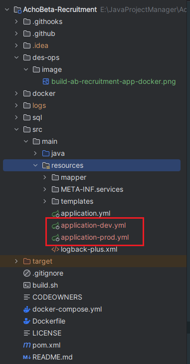
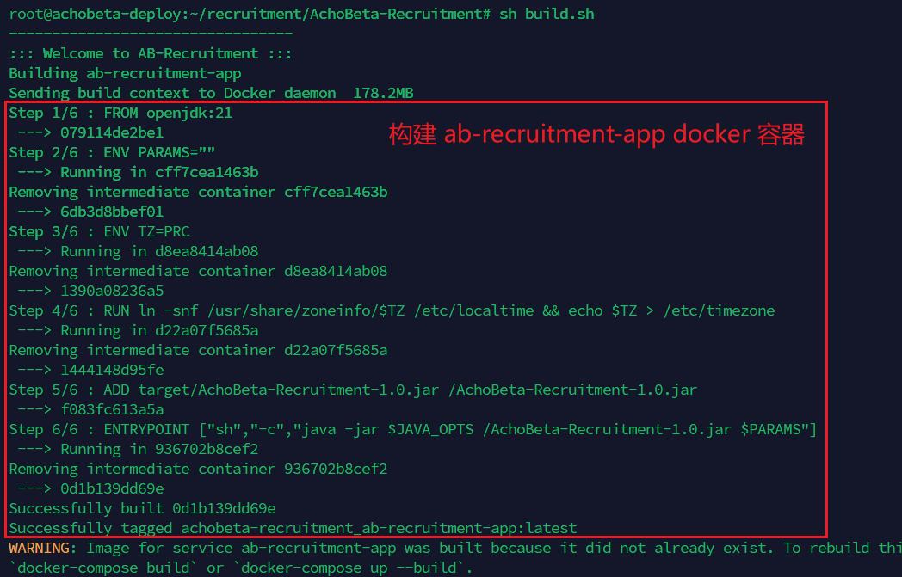
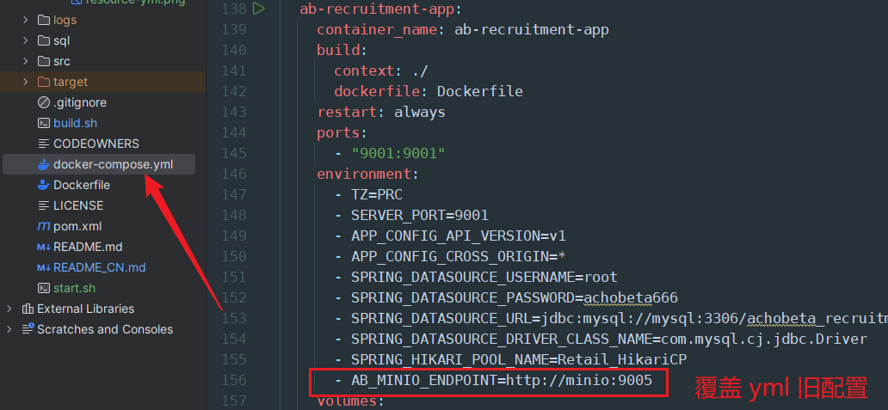

# AchoBeta-Recruitment
AchoBeta 团队招新系统

# 开发之前

1. 请在根目录执行下面的命令

```shell
git config core.hooksPath .githooks 
chmod -R -x .githooks 
```

+ 上述命令的目的是在 git 提交时触发钩子以确认提交消息格式是否正确。

2. **请阅读下面的开发规范**

# 分支命名约定
必须确保:

1. 分支名应当携带上开发者名称以便标识

2. 分支名必须清楚的表述该分支解决了什么问题

分支命名必须标准化, 参照该格式进行分支命名
```bash
<type>-<name>-<description>
```
举个例子:
- 如果它是开发新功能的分支，则命名约定如下
```bash
feature-<name>-<feature description>
e.g.: feature-jett-dev_log_system
```

- 如果他是为了修复 bug 而开辟的分支:
```bash
bugfix-<name>-<bug name>
e.g.: bugfix-jett-login_error
```
其他分支功能类型如下:
`hotfix`、`release`...


# 提交信息规范
提交信息应尽可能清晰，且每个提交只实现一个小功能以达到细粒度。

```bash
<type>(<scope>): <subject>

e.g.: feat: add new api
or: feat(common): add new api
```

## type

```text
# 主要type
feat:     增加新功能
fix:      修复 bug

# 特殊type
docs:     只改动了文档相关的内容
style:    不影响代码含义的改动，例如去掉空格、改变缩进、增删分号
build:    构造工具的或者外部依赖的改动，例如 webpack，npm
refactor: 代码重构时使用
revert:   执行 git revert 打印的 message

# 暂不使用type
test:     添加测试或者修改现有测试
perf:     提高性能的改动
ci:       与 CI（持续集成服务）有关的改动
chore:    不修改 src 或者 test 的其余修改，例如构建过程或辅助工具的变动
```

## subject

一个句子结尾请不要使用任何标点符号修饰

e.g.
```bash
feat: add new feature
fix: fix a bug
```

## 提交内容
无用 import 请删除，快捷键 ctrl + alt + o 也可以通过设置 idea 自动删除无用 import

# 部署

Linux 通过 git clone 克隆该项目

## 环境配置

需要找项目同学获取 application-dev.yml 和 application-prod.yml 文件

放在 src/main/resource 下（application-dev、prod 两个文件**不能 git push 到远程仓库！**）



## 两种部署方式

### Linux 一键式运行

前提是 Linux 上有 mvn 环境，不然会报错（建议 mvn 配置镜像代理，不然下载很慢）

命令：

```shell
cd AchoBeta-Recruitment/
sh build.sh
```


mvn 生成出的 target/xxx.jar 包会添加到 docker 构建成项目镜像，及上图表述

---

考虑到部署一般都是更新配置或者更改代码逻辑，故每次执行 build.sh 都会清空旧服务 ab-recruitment-app 容器

> （详可见根目录下 build.sh 文件）

或者可执行 start.sh 文件，两者的区别在于：

build.sh 会构建 springboot 所需的所有的环境， 而 start.sh 只启动 ab-recruitment-app 容器且端口为 9001

如果有改端口的要求，start.sh 要同步更改

### 本地生成 xxx.jar 包再迁移到 Linux 服务器上部署

做好改动后，在本地上执行 mvn 命令生成出 jar 包

```shell
mvn clean install package -Dmaven.test.skip=true
```

通过 mcp 命令或 SFTP 将本地 target 包里的 jar 包迁移到 Linux 同目录的 target 包里

在 Linux 执行 `sh build.sh` 命令完成部署

## 特殊部署

每次改动都要重新构建 jar 包很麻烦，如果仅仅针对 yml 配置文件进行配置方面的修改

可以直接在 docker-compose.yml 文件里找到 ab-recruitment-app 的 environment，增加新配置覆盖 yml 旧配置 `- key=value`



其中 key 为 `AB_MINIO_ENDPOINT`，对应 yml 里的 ab.minio.endpoint
value 为 `http://minio:9005`, 对应 yml 里的具体内容

这样可以达到覆盖的目的